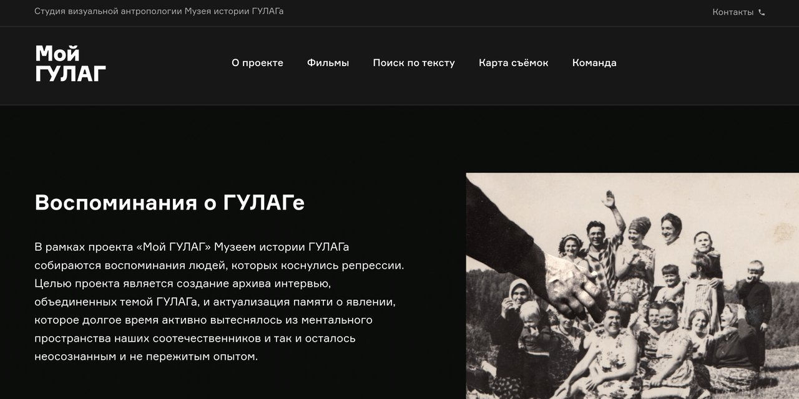

# Мой ГУЛАГ

*My GULAG*

Архив видеовоспоминаний людей, прошедших через советские политические репрессии, — проект студии визуальной антропологии Музея истории ГУЛАГа.

**[Открыть архив →](https://gulag-museum.github.io/mygulag.ru/)** · [Все сохранённые сайты](https://gulagmemory.org)

| | |
|:--|:--|
| **Тип** | Архив видеоинтервью |
| **Годы** | с 2013 |
| **Исходный адрес** | `mygulag.org`, ранее `mygulag.ru` |
| **Адрес архива** | [gulag-museum.github.io/mygulag.ru](https://gulag-museum.github.io/mygulag.ru/) |
| **Снимок сделан** | сентябрь 2026 · `wget` с живого сайта (1С-Битрикс) |

## О проекте

Музей истории ГУЛАГа и Фонд Памяти записывали интервью с теми, кого коснулись репрессии: лагерниками, раскулаченными, депортированными, детьми репрессированных, свидетелями, диссидентами — и с бывшими сотрудниками НКВД и их детьми. Вопросы задаёт не историк, а режиссёр-документалист: важны не только слова, но и паузы, интонации, реакции. У каждого смонтированного фильма есть полная версия интервью и расшифровка.

Авторы проекта — Роман Романов и режиссёр Людмила Садовникова. По данным сайта, записано 800 видеовоспоминаний.

**Проект перенесён на [mygulag.org](https://mygulag.org).** При переносе восстановлены утерянные связи в базе данных — к фильмам вернулись фотографии и документы героев, — а изображения переведены в WebP. Этот репозиторий — снимок живого mygulag.org, сделанный в сентябре 2026 года.

## Что сохранено

- все 433 фильма с описаниями и биографиями героев;
- около 1 300 фотографий и документов к фильмам — вчетверо больше, чем в мартовском снимке;
- полные, не смонтированные версии интервью (вкладка «Полное интервью») — 156 страниц;
- рубрикатор по категориям героев, новости проекта, страницы «О проекте» и «Команда».

## Что не работает

- поиск по тексту интервью и карта съёмок не работают;
- видео встроены с YouTube и VK Видео;
- для GitHub изображения уменьшены до 2560 px по длинной стороне; оригиналы — на mygulag.org.

---

Репозиторий входит в [реестр сохранённых сайтов Музея истории ГУЛАГа](https://gulagmemory.org) — некоммерческий архив цифрового наследия, созданный в исследовательских и образовательных целях. Права на тексты, фотографии, видео и другие материалы принадлежат их авторам и правообладателям.

<b>English</b>

### My GULAG

Oral history archive of the GULAG History Museum's visual anthropology studio: filmed interviews with survivors of Soviet political repression, their children, witnesses and former NKVD staff. Each edited film is accompanied by the full interview and a transcript. The project has moved to mygulag.org; this is a September 2026 snapshot of the live site (433 films, ~1,300 photos and documents; images downscaled to 2560 px).

**Type:** Oral history video archive · **Original address:** `mygulag.org`, ранее `mygulag.ru` · **Archive:** [gulag-museum.github.io/mygulag.ru](https://gulag-museum.github.io/mygulag.ru/)

Part of the [registry of preserved GULAG History Museum websites](https://gulagmemory.org) — a non-commercial digital heritage archive for research and education. All texts, photographs, video and other materials remain the property of their authors and rights holders.

